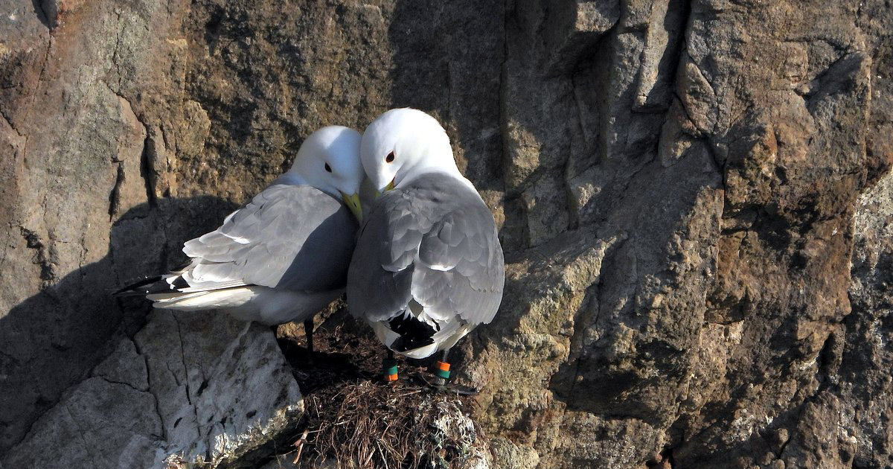
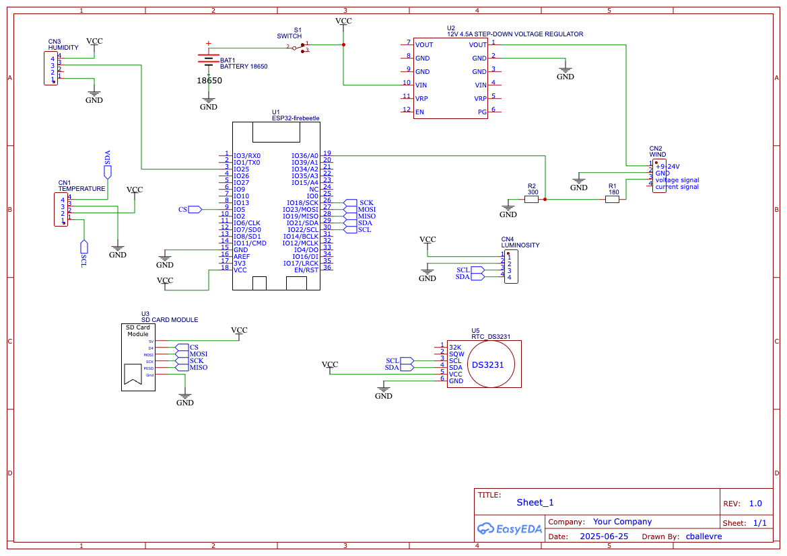

# Tridactyl Logger

This sensor is designed to characterise the environmental parameters of cliffs where kittiwakes nest. The sensor collects information on temperature, humidity and wind speed. These parameters can influence the breeding rate. The aim is to compare them between cliffs to define the pressures on the environment.

## Components

This logger is based onto an ESP32 FireBeetle from DFRobot.

### Sensors :

- Wind : Wind Speed Sensor Voltage Type 0-5V SKU SEN0170 ([docs](https://wiki.dfrobot.com/Wind_Speed_Sensor_Voltage_Type_0-5V__SKU_SEN0170))
- Temperature and humidity : DHT22 ([docs](https://wiki.seeedstudio.com/Grove-Temperature_and_Humidity_Sensor_Pro/))
- Luminosity : I2C Waterproof Ambient Light Sensor 1-65535lx ([docs](https://wiki.dfrobot.com/SKU_SEN0562_Gravity_I2C_Waterproof_Ambient_Light_Sensor_1_65535lx))
- Temperature : Fermion: MCP9808 High Accuracy I2C Temperature Sensor ([docs](https://wiki.dfrobot.com/Fermion_MCP9808_High_Accuracy_I2C_Temperature_Sensor_SKU_SEN0435))

### Additionnals :

- RTC : DS3231 Precision RTC Breakout for Arduino Wiki - DFRobot ([docs](https://wiki.dfrobot.com/Fermion_DS3231_Precise_RTC_Breakout_SKU_DFR0819))
- SD reader
- 12V Step-Up Voltage Regulator : U3V40F12 ([ref](https://www.pololu.com/product/4016))

## Schema

## Libraries needed

- https://github.com/Seeed-Studio/Grove_Temperature_And_Humidity_Sensor
- https://github.com/DFRobot/DFRobot_MCP9808
- https://github.com/NorthernWidget/DS3231
